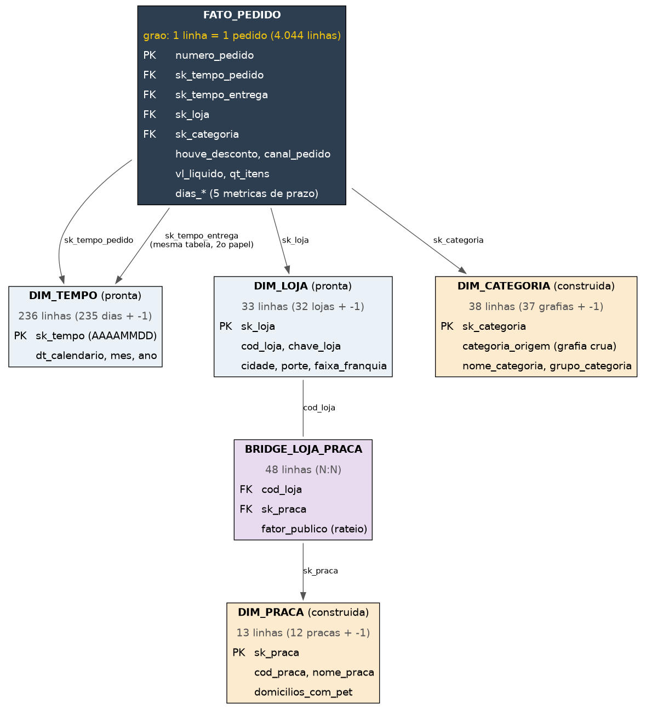

# Pata Amiga — Data Warehouse e Análise de Dados (PostgreSQL)

Mini-projeto avaliativo — Análise de Dados com Python [T1], Módulo 2, Semana 7.
Repositório: **https://github.com/jsidegum/pata-amiga-dw**

Rede catarinense de 32 pet shops. Em 7 meses (set/2023–mar/2024) foram 4.044 pedidos,
registrados em três sistemas que não conversam entre si (e-commerce, cadastro de lojas e
planilha de praças). Este repositório monta o Data Warehouse que junta as três fontes e
responde cinco perguntas de negócio da diretoria.

## Sumário
1. [Estrutura do repositório](#1-estrutura-do-repositório)
2. [Diagnóstico da origem](#2-diagnóstico-da-origem)
3. [Modelo dimensional](#3-modelo-dimensional)
4. [Decisões de tratamento](#4-decisões-de-tratamento)
5. [Como rodar](#5-como-rodar)
6. [As cinco respostas](#6-as-cinco-respostas)
7. [Recomendação](#7-recomendação)
8. [O que os dados não permitem afirmar](#8-o-que-os-dados-não-permitem-afirmar)

---

## 1. Estrutura do repositório

```
pata-amiga-dw/
├── assets/
│   └── modelo-dimensional.png      # Diagrama estrela do modelo
├── sql/
│   ├── 01-carga-staging.sql        # Carga das 3 tabelas stg (já fornecido)
│   ├── 02-dimensoes-prontas.sql    # dim_tempo e dim_loja (já fornecido)
│   ├── 03-dimensoes-custom.sql     # dim_categoria, dim_praca e bridge_loja_praca
│   ├── 04-carga-fato.sql           # fato_pedido (INSERT ... SELECT)
│   └── 05-perguntas-negocio.sql    # Consultas P1 a P5
├── README.md
└── .gitignore
```

Os scripts em `sql/` devem ser rodados na ordem em que estão numerados.

---

## 2. Diagnóstico da origem

| Tabela           | Linhas |
|------------------|-------:|
| `stg_pedido`     |  4.044 |
| `stg_loja`       |     32 |
| `stg_loja_praca` |     48 |

| Diagnóstico (`stg_pedido`)                    | Valor |
|------------------------------------------------|------:|
| Grafias distintas de `CategoriaProduto`         | 37 |
| Grafias distintas de `Loja-Nome`                | 128 |
| Grafias distintas de `HouveDesconto`            | 17 |
| Grafias distintas de `CanalPedido`              | 20 |
| Pedidos sem `Cod Loja`                          | 1.575 (~39%) |
| Pedidos sem `Loja-Nome`                         | 3 |
| `Dt Separacao Estoque` em branco                | 1.077 |
| `DtNotaFiscal` em branco                        | 1.338 |
| `Dt_Despacho_Transportadora` em branco          | 1.665 |
| `DtEntregaCliente` em branco                    | 1.953 |

Resumo: a mesma loja é escrita de 128 formas (acento, caixa, `/SC`, espaço duplo e 3
erros de digitação/apelido/abreviação); a mesma categoria, de 37 formas (com a pegadinha
"Ração Medicamentosa" = Medicamento, não Ração); desconto e canal têm poucos valores reais
mas grafias sujas; 39% dos pedidos não têm código de loja (por isso o cruzamento na fato é
por nome, não por código); e os marcos em branco são etapas do processo ainda em aberto,
não erro.

---

## 3. Modelo dimensional

Star schema: uma fato, quatro dimensões, uma ponte.



| Tabela               | Linhas | Observação |
|----------------------|-------:|------------|
| `fato_pedido`         | 4.044  | grão: 1 linha = 1 pedido |
| `dim_tempo` (pronta)  | 236    | chave = data em `AAAAMMDD`; usada 2x na fato (pedido e entrega — *role-playing dimension*) |
| `dim_loja` (pronta)   | 33     | 32 lojas + linha -1 |
| `dim_categoria`       | 38     | grão: 1 grafia da origem; guarda a grafia crua em `categoria_origem` |
| `dim_praca`           | 13     | 12 praças + linha -1 |
| `bridge_loja_praca`   | 48     | N:N loja↔praça, com o fator de rateio (`fator_publico`) |

`dim_praca` só se liga à fato indiretamente, via `dim_loja` + `bridge_loja_praca` — nunca
direto. Ficaram de fora da fato (por escolha): valor bruto, desconto em reais, unidades
devolvidas, itens cancelados, peso e frete — nenhuma das 5 perguntas usa.

---

## 4. Decisões de tratamento

- **Datas**: pedido em `MM/DD/YYYY HH12:MI AM` (americano); os 4 marcos do processo em
  `AAAA-MM-DD`. Usar máscara brasileira na primeira faria o Postgres **lançar erro**.
- **`vl_liquido` / `qt_itens`**: `''` e `'-'` viram `NULL`, nunca `0`.
- **Categoria**: `CASE` sobre `UPPER(TRANSLATE(...))` (sem acento/caixa, pois o Postgres
  compara byte a byte). **Ordem importa**: `MED` antes de `RA`, senão "Ração
  Medicamentosa" cairia em Ração.
- **Nome da loja**: `REPLACE`/`TRIM` tira `/SC` e espaço duplo; depois um `CASE` manual
  corrige os 3 casos que sobram (digitação, apelido, abreviação); só então compara com
  `dim_loja.chave_loja`. Sem match → linha -1.
- **Desconto/canal**: não viram dimensão (poucos valores, nada pendurado). Canal também
  depende da ordem do `CASE` — `WHATS` antes de `APP`, pois "WHATSAPP" contém "APP"
  (conferido: WhatsApp aparece com 414 pedidos na fato).
- **Dias de processo**: marco de fim em branco → `NULL`, nunca `0` (senão o gargalo
  pareceria mais rápido do que é).
- **Linha -1**: toda dimensão construída tem uma linha "Nao Informado", inserida antes do
  `INSERT ... SELECT`, para nenhuma FK da fato ficar nula.

---

## 5. Como rodar

Clone o repositório:

```bash
git clone https://github.com/jsidegum/pata-amiga-dw.git
cd pata-amiga-dw
```

Depois, rode os scripts da pasta `sql/`, nesta ordem:

1. `01-carga-staging.sql` — cria o banco `dw_pata_amiga` e carrega as 3 tabelas de
   staging (origem bruta).
2. `02-dimensoes-prontas.sql` — cria as tabelas do modelo dimensional (vazias) e popula
   `dim_tempo` e `dim_loja`.
3. `03-dimensoes-custom.sql` — Popula as dimensões `dim_categoria`, `dim_praca` e a tabela ponte
   `bridge_loja_praca`.
4. `04-carga-fato.sql` — Popula a `fato_pedido` através de um único
   `INSERT ... SELECT`.
5. `05-perguntas-negocio.sql` — Consulta e responde as 5 perguntas de negócio.

Ao clonar o repositório e executar os cinco scripts na ordem indicada, o banco é recriado do zero. O pipeline foi testado em um PostgreSQL 16 limpo, sem erros, com todos os números de conferência do enunciado compatíveis.

---

## 6. As cinco respostas

**P1 — Gargalo da entrega.** Média de **9,0 dias** do ERP até o cliente. O intervalo mais
lento é **Nota → Despacho** (4,1 dias, mais que a soma dos outros três). O gargalo é o
mesmo estágio nos três portes, mas muito mais grave nas lojas pequenas:

| Porte   | Nota→Despacho | Total até entrega |
|---------|:-------------:|:-------------------:|
| Grande  | 3,3 | 7,9 |
| Média   | 3,3 | 8,0 |
| Pequena | **8,5** | **15,2** |

**P2 — Categoria que concentra faturamento.** **Ração = 60% do faturamento**
(R$ 1.076.202,55), seguida de Medicamento (17,1%) e Petisco (7,2%). Ração é campeã nos
três portes de loja, sem exceção.

**P3 — Desconto por canal.** Ticket médio COM desconto é sempre 2,6–2,9x maior que SEM
desconto, em todos os 5 canais — o padrão se repete igual em todo canal:

| Canal       | Sem desconto | Com desconto | % do faturamento |
|-------------|-------------:|--------------:|-------------------:|
| App         | R$ 170,48 | R$ 488,04 | 30,79% |
| Site        | R$ 189,48 | R$ 501,92 | 25,13% |
| Loja Física | R$ 196,78 | R$ 494,04 | 20,11% |
| WhatsApp    | R$ 173,88 | R$ 514,33 | 10,52% |
| Telefone    | R$ 195,46 | R$ 514,02 |  6,88% |
| Não informado | R$ 212,83 | R$ 561,59 |  6,57% |

(O canal "Não informado" cobre pedidos com `CanalPedido` em branco na origem — o padrão
COM/SEM desconto se repete mesmo aqui, o que reforça que a diferença é sistêmica, não um
efeito de canal específico. Com essa linha, os percentuais fecham em 100%.)

**P4 — Praça que concentra faturamento.** **Vale do Itajaí lidera**, com R$ 633.746,09
de faturamento rateado (mais que o dobro da 2ª colocada) e o maior retorno por domicílio
com pet (R$ 4,28, quase o dobro da 2ª colocada). Fechamento confirmado: rateado
(R$ 1.792.322) + sem loja (R$ 986) = total da rede (R$ 1.793.309), diferença zero.

**P5 — Próxima loja / o que falta.** Ranking por itens vendidos por mil habitantes:
lideram cidades pequenas, mas as com maior demanda per capita (Rio dos Cedros,
Presidente Getúlio, Ibirama) têm entrega lenta (14–15 dias); já Timbó e Gaspar combinam
demanda alta **e** entrega rápida (7,7–8,0 dias). Faturamento por faixa de franquia
**atual**: Ouro 56,4%, Diamante 21,3%, Prata 17,6%, Bronze 4,7% — atenção: essa faixa é a
de hoje, o histórico foi sobrescrito, então isso não responde quanto veio de lojas que
**já eram** Ouro na data do pedido. O que ficou de fora: 3 pedidos sem loja, **1.953
entregas ainda não concluídas (48% da base)**, 257 pedidos com itens em branco, 121 com
valor em branco.

Esses 1.953 "sem entrega" não são todos atraso — a coluna `SituacaoPedido` da origem
(não usada em nenhuma das 5 perguntas, só citada aqui como diagnóstico) qualifica cada
um deles:

| Situação                 | Pedidos | % do "sem entrega" |
|--------------------------|--------:|--------------------:|
| Retirada na loja         |     872 | 44,6% |
| Aguardando despacho      |     327 | 16,7% |
| Despachado - em trânsito |     288 | 14,7% |
| Aguardando nota fiscal   |     261 | 13,4% |
| Pedido cancelado         |     205 | 10,5% |

Quase metade (44,6%) é retirada na loja — pedidos que, por definição, nunca teriam uma
`DtEntregaCliente` preenchida, não porque atrasaram. E 10,5% são cancelamentos, que
também nunca serão entregues. Só a soma de "Aguardando despacho" + "Despachado - em
trânsito" + "Aguardando nota fiscal" (44,8%, ~876 pedidos) representa atraso real de
processo ainda em curso.

---

## 7. Recomendação

Abrir a próxima loja na região do **Vale do Itajaí**: já concentra o maior faturamento
rateado e o maior retorno por domicílio com pet (P4), e tem cidades (Timbó, Gaspar) com
demanda per capita alta e entrega rápida (P5) — diferente das cidades pequenas de outras
regiões, onde a demanda é alta mas a entrega já está no limite. Independente de onde a
loja abrir, o intervalo Nota → Despacho precisa ser resolvido antes: é o gargalo da rede
inteira, e quase 3x pior nas lojas pequenas.

## 8. O que os dados não permitem afirmar

- Que o desconto **causa** o ticket maior (P3): a correlação é forte, mas não isola se o
  desconto é dado preferencialmente em pedidos já maiores.
- Quanto do faturamento veio de lojas que **já eram** Ouro na data do pedido (P5): o
  cadastro só guarda a faixa atual.
- O prazo real de entrega da base inteira: as médias de P1/P5 usam só os pedidos já
  entregues — os 48% ainda em aberto podem puxar o prazo médio para qualquer direção.
- Sazonalidade: a janela cobre só 7 meses, incluindo a alta de fim de ano; não dá para
  separar padrão estrutural de efeito de temporada.
